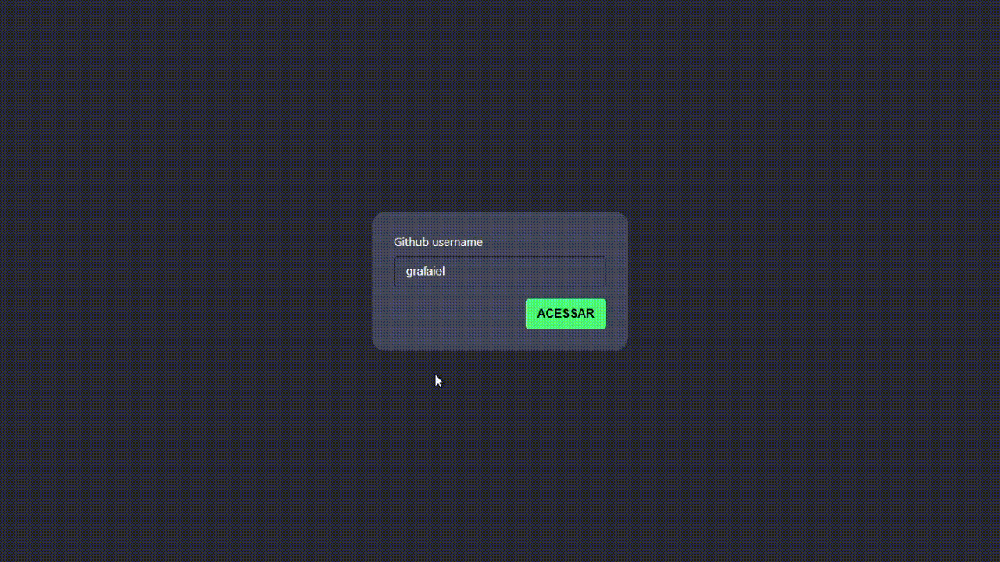

# Atividade Desenvolvida na Aula de React com<a href="https://github.com/viniciusdacal"> Vinicius Dacal </a> 

	

### Atividade final

- [x] Mostrar mensagem de Loading na listagem de usuários.
- [x] Mover a listagem de repositórios para GraphQL.
- [x] Ao selecionar um repositório, deve mostrar uma listagem de issues daquele repositório (Pode listar somente as 10 mais recentes).

Cada item da listagem de issues deve mostrar:

- O título (title)
- A descrição da issue (body)
- Link para a issue no github (resourcePath)

Referências:

Link para o explorer da api. Você pode autenticar, escrever e testar suas queries GraphQL.

[https://docs.github.com/en/graphql/overview/explorer](https://docs.github.com/en/graphql/overview/explorer)

Documentação da API GraphQL:

[https://docs.github.com/en/graphql/reference/queries](https://docs.github.com/en/graphql/reference/queries)